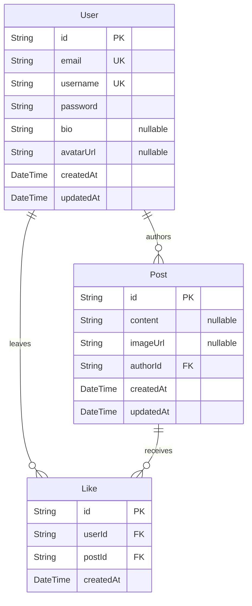

# Entity Relationship Diagram (ERD)

```mermaid
erDiagram
    User ||--o{ Post : "authors"
    User ||--o{ Like : "leaves"
    Post ||--o{ Like : "receives"

    User {
        String id PK
        String email UK
        String username UK
        String password
        String bio "nullable"
        String avatarUrl "nullable"
        DateTime createdAt
        DateTime updatedAt
    }

    Post {
        String id PK
        String content "nullable"
        String imageUrl "nullable"
        String authorId FK
        DateTime createdAt
        DateTime updatedAt
    }

    Like {
        String id PK
        String userId FK
        String postId FK
        DateTime createdAt
    }
```
